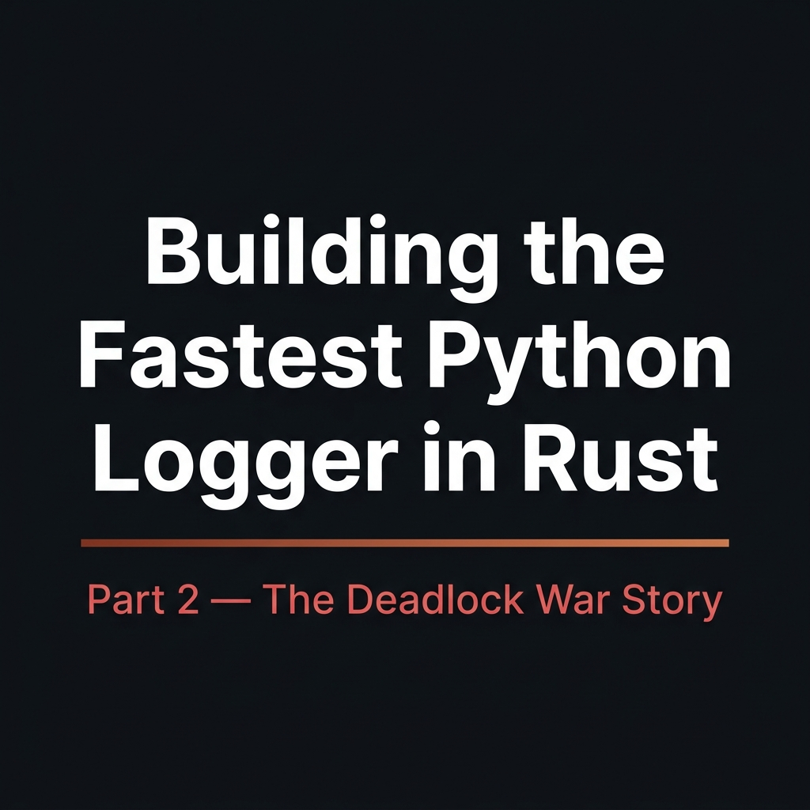

# Building the Fastest Python Logger in Rust — Part 2: The Deadlock War Story



The test suite had been running for 47 seconds when it stopped. No error. No output. Just... nothing.

I stared at the terminal. The cursor wasn't blinking. The progress bar had frozen mid-frame. I hit Ctrl+C. Nothing. I hit it again, harder, as if that would help. The process was deadlocked somewhere deep in the call stack, and I had no idea where.

This was LogXide, my Rust-powered drop-in replacement for Python's logging module. I'd spent weeks making it up to 13× faster than stdlib. The benchmarks were beautiful. Then I merged to main, and everything caught fire.

If you haven't read Part 1, it covers what LogXide actually does: you `pip install logxide`, replace `import logging` with `from logxide import logging`, and suddenly your log calls drop from ~6 microseconds to ~0.5 microseconds. Same API, same handlers, same everything — just Rust underneath. It works with Flask, Django, FastAPI, Sentry, OTLP. That's the happy path. This is the story of how I almost never got there.

---

To understand why this deadlocked, you need to know how LogXide is structured.

The architecture is basically a bet: what if the entire hot path of Python logging never touched the Python interpreter? `logger.info("Hello")` still looks like Python. But under the hood, the string gets converted to a Rust `String`, packaged into a `LogRecord` (a Rust struct), and processed entirely in native code.

`PyLogger` is a `#[pyclass]` in `src/py_logger.rs`. It wraps a Rust `FastLogger`. Handlers are Rust traits behind `Arc<dyn Handler + Send + Sync>`. The global registry lives in `globals.rs` as `HANDLERS: Mutex<Vec<Arc<dyn Handler + Send + Sync>>>`. File I/O uses `std::fs`. HTTP shipping uses `reqwest`. OTLP uses `opentelemetry-rust`. Only the bridge layer touches PyO3, and only to convert types.

I didn't build a Python logging framework in Rust. I built a Rust logging framework with a Python-compatible API. That separation is what made the speedup possible. It's also what made the deadlock inevitable.

The performance gains come from three places. First, format string parsing happens in Rust. Standard patterns like `%(asctime)s - %(name)s` get compiled into operations at initialization time. At log time, it's just direct field access and concatenation. No Python dictionary lookups.

Second, the fast path is lock-free. `FastLogger` caches level checks in an `AtomicU8`. A filtered-out `DEBUG` call when the level is `INFO` compiles to a single atomic load and a branch. No locks. No allocations. Nearly free.

Third, all I/O is Rust-native and GIL-free. Python's threads keep running while LogXide writes to disk or sends HTTP requests.

Here's how it shook out against the alternatives (Python 3.12, FileHandler, 10K iterations):

| Library         |   Ops/sec | vs stdlib |
| :-------------- | --------: | :-------- |
| **LogXide**     | **1,139,874** | **7.85×** |
| Structlog       |   932,755 | 6.42×     |
| Picologging (C) |   384,319 | 2.65×     |
| stdlib          |   145,260 | 1.0×      |
| Loguru          |    93,896 | 0.65×     |

The ~3× edge over Picologging? Picologging reimplements logging in C but still calls back into Python for I/O. LogXide's handlers are pure Rust end to end. Plus Picologging doesn't run on Python 3.13+ — its Cython bindings are incompatible with recent CPython API changes.

I ran the benchmarks, saw the numbers, and felt pretty good about myself. Then I ran the multi-threaded tests.

---

At first, the failures looked like flaky CI. A job would time out after ten minutes with no output. I'd retry it, and it would pass. I checked the GitHub Actions runner logs. Nothing useful. Just "Process completed with exit code 124," which means the step hit its timeout and got killed.

I started running the test suite locally in a loop. `while true; do cargo test; done`. It took about twenty runs before I saw the freeze myself. When it finally happened, I just sat there watching the terminal, waiting for it to move. It didn't.

My first theory was an infinite loop. I added `println!` everywhere. The prints stopped in random places. Sometimes during handler flush. Sometimes during log emission. The common thread was always concurrency plus a mix of Python handlers and Rust handlers.

I spent an entire afternoon running tests with `RUST_BACKTRACE=1`, hoping to catch something mid-hang. Backtraces don't help with deadlocks. Both threads are perfectly healthy. They're just waiting.

Then I added a timeout thread that panicked if a log operation took more than five seconds. The panic showed two threads stuck: one in `emit_record`, one in what looked like ordinary Python code. That was the first clue. This wasn't a logic bug. This was a lock ordering problem.

To see it, you have to picture two resources that both want exclusive access:

1. A Rust `Mutex` guarding the handler list
2. The Python Global Interpreter Lock (GIL)

If Thread A grabs the Mutex and then tries to acquire the GIL, while Thread B holds the GIL and tries to grab that same Mutex... neither can proceed. They wait forever.

The naive `emit_record` looked harmless. It was not:

```rust
// DEADLOCK
fn emit_record(&self, record: LogRecord) {
    let handlers = self.python_handlers.lock().unwrap();
    Python::attach(|py| {
        for handler in handlers.iter() {
            handler.call_method1(py, "emit", (&record,));
        }
    });
}
```

Thread A gets the Mutex on line 2. Thread B (somewhere else in Python) gets the GIL. Thread A tries `Python::attach()` on line 3 and blocks, waiting for the GIL. Thread B tries to log, needs the Mutex, and blocks waiting for Thread A. Classic deadlock.

The fix is the clone-and-release pattern. `Py<PyAny>` needs the GIL to clone (`clone_ref(py)`), so you enter the GIL scope first. But you keep the mutex guard inside a nested block, clone everything you need, and let the guard drop before calling into Python:

```rust
// FIXED
fn emit_record(&self, record: LogRecord) {
    Python::attach(|py| {
        let handlers: Vec<Py<PyAny>> = {
            let lock = self.python_handlers.lock().unwrap();
            lock.iter().map(|h| h.clone_ref(py)).collect()
        }; // Mutex released here
        for handler in handlers.iter() {
            handler.call_method1(py, "emit", (&record,));
        }
    });
}
```

It's microseconds under the lock — just bumping reference counts. Then you're free.

I thought that was the end of it. I committed the fix, pushed it, and ran CI. It failed again. Different test, same hang.

That's when I realized there was a second pattern. The `flush()` function calls `handler.flush()`, and some handlers block. `HTTPHandler` waits for in-flight requests. `OTLPHandler` retries failed exports. If you hold the GIL while that happens, Python's other threads can't run. And if any background thread needs the GIL to deliver a callback... deadlock.

The broken code looked like this:

```rust
// DEADLOCK
pub fn flush(py: Python) -> PyResult<()> {
    let handlers = HANDLERS.lock().unwrap();
    for h in handlers.iter() {
        h.flush();  // blocks!
    }
    Ok(())
}
```

The fix: clone the handler list, then use `py.detach()` (PyO3 0.28's replacement for `allow_threads`) to release the GIL during the blocking work:

```rust
// FIXED
pub fn flush(py: Python) -> PyResult<()> {
    let handlers: Vec<Arc<dyn Handler + Send + Sync>> =
        { HANDLERS.lock().unwrap().clone() };
    py.detach(|| {
        for h in handlers.iter() {
            h.flush();
        }
    });
    Ok(())
}
```

`py.detach()` drops the GIL for the closure duration. Other Python threads run. I/O completes. Everyone is happy.

In total, I found five sites that needed fixing across two files. Four in `py_logger.rs`: Python handler dispatch, local Python handler dispatch, filter evaluation, and the `handle()` method. One in `globals.rs`: the `flush()` implementation.

Every fix followed the same two rules: never hold a Rust lock while calling Python, and never hold the GIL while doing blocking I/O.

After the fifth fix, I ran the test suite fifty times in a loop. Green every time. I pushed to CI. Green. I can't describe the relief of seeing that checkmark after weeks of random timeouts.

---

If I could go back and tell past-me one thing, it would be this: draw the lock ordering diagram before you write the code. I spent days chasing ghosts because I hadn't explicitly decided which lock comes first. My rule now is simple: if you need both the GIL and a Mutex, acquire the GIL first, grab the Mutex second, clone what you need, and drop the Mutex immediately. Violate that order, and you die.

Another thing I learned the hard way: `clone_ref` and `Arc::clone` are nanoseconds of work. They're reference count bumps. When your alternative is a deadlock that only reproduces 30% of the time in CI, clone everything. Clone early, clone often. It's the cheapest insurance you'll ever buy.

And test with real concurrency. Unit tests didn't catch this because they were single-threaded. I needed threads spawning threads, all logging at once, with actual HTTP handlers and file I/O flying in the background. Add stress tests early. Your future self will thank you when 3 AM debugging sessions don't happen.

---

LogXide is fast now. The benchmarks are real. But the number I care about more is zero: zero deadlock failures in CI since the fix.

There's something deeply satisfying about solving a problem that hides from you. A crash gives you a stack trace. A deadlock gives you silence. You have to reason your way through it, thread by thread, lock by lock, until the picture finally clicks into place. It's frustrating and isolating and occasionally makes you want to delete the repository and become a farmer.

But when it works, when the tests pass fifty times in a row and you understand exactly why... that's the good stuff. That's why I keep doing this.

Source: [github.com/Indosaram/logxide](https://github.com/Indosaram/logxide)
